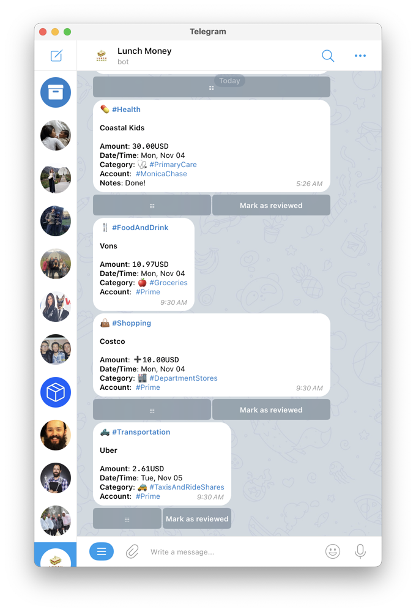
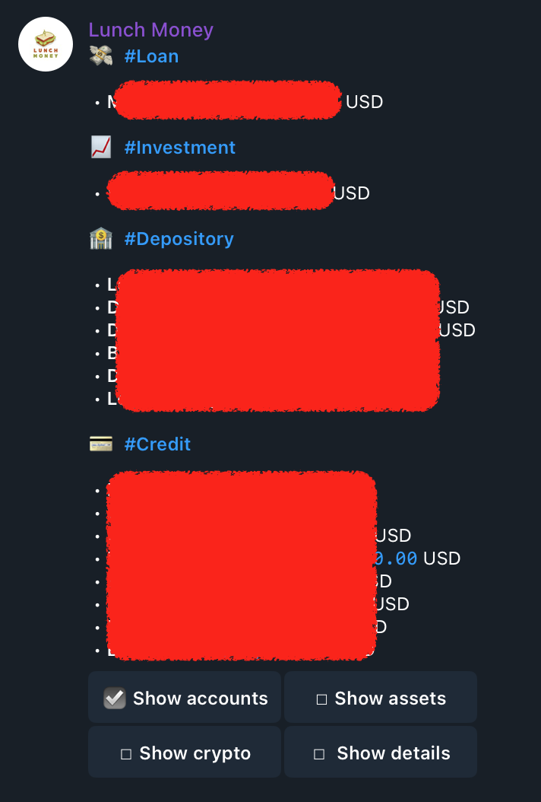

# 🥡 Lonchera

[Lonchera is a Telegram bot](https://t.me/LunchMoneyAppBot) that seamlessly integrates with the
[Lunch Money](https://lunchmoney.app/) personal finance application, empowering users to
effortlessly manage their financial transactions right from Telegram.

# 🔍 Transaction Monitoring
- Periodically checks for new transactions and sends notifications to the user
- Allows users to manually request a list of recent transactions

# 🏷️ Transaction Management
For each transaction, users can:
- Change the category
- Add tags
- Add notes
- View Plaid details (if available)
- Mark the transaction as reviewed (or unreviewed)
- Change the payee's name

# 💸 Manual Transactions

- Enables users to manually add transactions for accounts not managed by Plaid

This is very useful when tracking cash or other kinds of accounts.

# 📊 Budget Tracking

- Displays the current state of the user's budget for the current month

# 🤖 AI-Powered Transaction Categorization

- Leverage the [DeepInfra API](https://deepinfra.com/) to automatically categorize transactions using AI
- This feature helps in accurately categorizing expenses without manual intervention

# Show balances

- It can also show you the balances of all your accounts at a point in time

# ⚙️ Customizable Settings
- Change the polling interval for new transactions
- Toggle auto-marking of transactions as reviewed
- Manage the Lunch Money API token

# 🚀 Getting Started
1. Clone the repository
2. Set up your Telegram bot token and Lunch Money API token
3. Build and run the Docker container using the provided scripts
  * Make sure to provide a local .env file with TELEGRAM_BOT_TOKEN=xxxx with the API of your own telegram bot

# 📚 Self-Hosting Guide
For detailed instructions on how to run your own instance of the bot, please refer to the [SELFHOST.md](SELFHOST.md) file.

## Note:

There is a publicly available instance of the bot that I am currently using myself:

https://t.me/LunchMoneyAppBot

However, please consider the following before using it:
- I run this instance without any uptime or security guarantees.
- I cannot guarantee the safety of your data.
- Use this instance at your own risk.

If you decide to use it, please be aware that while I promise not to look at or use your token, I cannot provide any assurances beyond my word.

The bot is designed to support multiple users, meaning the same bot can track transactions for different accounts, such as mine and my wife's, in their respective Telegram accounts.

# 📄 License
This project is licensed under the [MIT License](LICENSE.md).

---

🍱 Happy expense tracking! 🎉